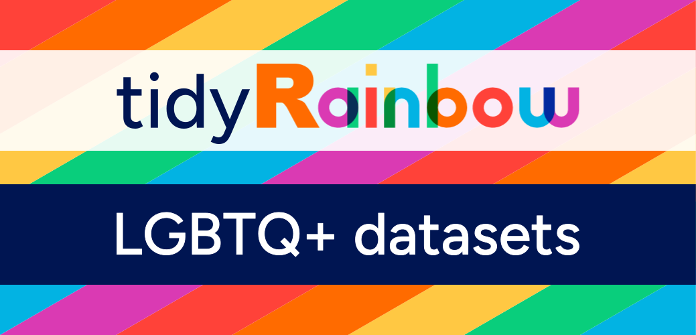

 

## About tidyRainbow

tidyRainbow is a social data project by [rainbowR](https://rainbowr.org/), a community that supports, promotes and connects LGBTQ+ people who code in the R language, and spreads awareness of LGBTQ+ issues through data-driven activism. The tidyRainbow project aims to encourage the use of LGBTQ+ inclusive datasets for learning R and showcasing R code. For example, for building and sharing data visualizations, or as example datasets for teaching, blogs or vignettes.

The tidyRainbow project was born out of a lack of LGBTQ+ representation in popular datasets used in data science. This repository hosts a collection of datasets that are LGBTQ+ inclusive. Inclusivity in this context means that the datasets in this repository focus on data pertaining to the LGBTQ+ community. We also welcome datasets in which LGBTQ+ people are explicitly represented and where it is not assumed that gender is binary. Additionally, we include datasets that are relevant to LGBTQ+ folks because of the impact it has on the community. 

## Get involved!

Inspired by [TidyTuesday](https://github.com/rfordatascience/tidytuesday) and the [R for Data Science](https://www.rfordatasci.com/) community, you can participate in the tidyRainbow project in two ways: 

- use the tidyRainbow datasets to practise programming in R, or share R code examples
- contribute a dataset to the tidyRainbow repository.

### Using tidyRainbow datesets

To promote the use of the taidyRainbow datasets, rainbowR will share every tidyRainbow dataset on social media, via our [mastodon](https://tech.lgbt/@rainbowR) account and on our [slack](https://rainbowr.slack.com) (sign up for our slack by joining rainbowR [here](https://rainbowr.org/join)). Then, you can use your data visualisation and analysis skills to explore the data--whatever you're inspired to do--and to share your insights online using the #tidyRainbow hashtag. The data will not always be tidy but should always be manageable! 

> We welcome everyone to participate: newcomers, enthusiasts, and experts!

How to proceed?

  1. The data come from the source or where the article sites/credits, so data will not be 100% clean 100% of the time.
  2. This data is meant for understanding the intersectionality of the global LGBTQ+ community, where injustices, civil rights, healthcare, politics, etc. and to learn from it. This repository is not about criticism or bigotry.
  4. Use the hashtag #tidyRainbow when you finish your data science work, if you choose to share it.
  5. Include a picture image of your data visualization, along with alt text (see below under Background info).
  6. We strongly encourage you to include a link to your code so others can learn from you. Alternatively, you could share a [Carbon image](https://carbon.now.sh/) of the code, though please be aware that is not as accessible as sharing a link to the code.
  7. Focus on learning something from the data!

### Submitting a dataset to the repository

If you have collected data that is relevant to the LGBTQ+ community, or when you have found a dataset that is LGBTQ+ inclusive and has a re-share licence, please do share it! Then rainbowR can include the dataset into the tidyRainbow repository and share it for others to use.

How to proceed?

  1. Collect or find an interesting dataset.
  2. Check under what licence the data can be (re-)shared (see below under Background info).
  3. Find a report, blog post, or article relevant to the data to give context to the dataset.
  4. Submit the dataset as an [Issue](https://github.com/r-lgbtq/tidyrainbow/issues) along with a link to the article.

## Datasets

Datasets included in the tidyRainbow repository.
- see the [data folder](https://github.com/r-lgbtq/tidyrainbow/tree/main/data)

Datasets not included in the tidyRainbow repository:
- [Sex Differences Across Sexual Orientation and Sexual Identity](https://osf.io/8tnd4/)

## Background info 

Please always add alt-text (alternative text) when you share your graphics for #tidyRainbow. And please always check the license of the data when you submit a dataset to the tidyRainbow repository.

### Alt Text

TL;DR on what to write:

- **Chart type:** line plot, bar plot, etc.
- **Type of data:** what is on x-axis? what is on y-axis?
- **Why:** why you made the plot graphic
- **Link:** link to the data or source

The longer version:

The DataViz Society/Nightingale has an [article](https://medium.com/nightingale/writing-alt-text-for-data-visualization-2a218ef43f81) on writing _good_ alt text for plots/graphs.
> Here’s a simple formula for writing alt text for data visualization:
> ### Chart type
> It’s helpful for people with partial sight to know what chart type it is and gives context for understanding the rest of the visual.
> Example: Line graph
> ### Type of data
> What data is included in the chart? The x and y axis labels may help you figure this out.
> Example: number of bananas sold per day in the last year
> ### Reason for including the chart
> Think about why you’re including this visual. What does it show that’s meaningful. There should be a point to every visual and you should tell people what to look for.
> Example: the winter months have more banana sales
> ### Link to data or source
> Don’t include this in your alt text, but it should be included somewhere in the surrounding text. People should be able to click on a link to view the source data or dig further into the visual. This provides transparency about your source and lets people explore the data.
> Example: Data from the USDA

Penn State has an [article](https://accessibility.psu.edu/images/charts/) on writing alt text descriptions for charts and tables.
> Charts, graphs and maps use visuals to convey complex images to users. But since they are images, these media provide serious accessibility issues to colorblind users and users of screen readers. See the [examples on this page](https://accessibility.psu.edu/images/charts/) for details on how to make charts more accessible.

### Licensing

A license tells you if and how data can be re-used. It allows us to include datasets into the tidyRainbow repository. 

This [blog post](https://odissei-data.nl/en/2024/04/how-can-i-use-this-data-the-importance-of-licences-to-facilitate-reuse/) by ODISSEI explains how liceses relate to research data :
> A licence allows the copyright holder of the material to set the conditions under which others can reuse that material. In a data repository, the licence for a dataset is typically chosen by the depositor of the data, and it should be displayed as part of the metadata.
