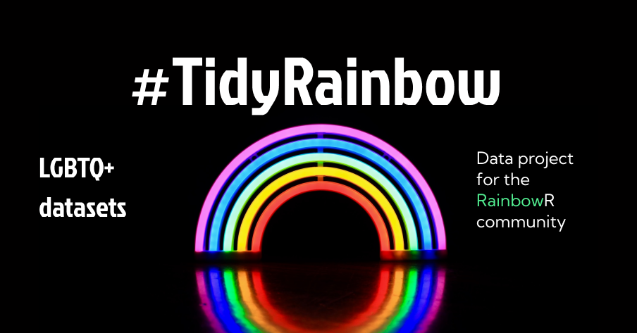

## A social data project in R

TidyRainbow is a data project aimed at the LGBTQ+ community who use the R language ecosystem.

This is borne out of the lack of LGBTQ+ representation in the data sets widely used in data science. This repository will host a collection of data sets that are LGBTQ+ inclusive. We encourage their use as examples when teaching and practicing data science.

The datasets in this repository focus on data that is **not binary in gender and where sexuality is beyond the assumption of heterosexuality, where LGBTQ+ people/persons are explicitly included**, as well as data that is of specific interest to LGBTQ+ folk because of the impact it has on the community.

## Get involved!

Inspired by [TidyTuesday](https://github.com/rfordatascience/tidytuesday) and the [R for Data Science community](https://www.rfordatasci.com/), we will also share, via our [twitter](https://twitter.com/R_LGBTQ) account and on our [slack](https://rainbowr.slack.com) (sign up for our slack [here](https://docs.google.com/forms/d/1y7SOWE3IW-fpR_5Cd4mK-CMUpFZ-hvhY4cTj34JqTVE/)) these data sets, one every two weeks or so. 

The goal is to use your data visualisation and analysis skills to explore the data - whatever you're inspired to do - and to share your insights (using #TidyRainbow on twitter). The data will not always be tidy but should always be manageable!

Once we've shared a data set via Twitter/Slack, we'll update the table of data sets with the date we've done so.

We welcome everyone to participate; newcomers, enthusiasts and experts.

Things to remember:

  1. The data come from the source or where the article sites/credits, so data will not be 100% clean 100% of the time
  
  2. This data is meant for understanding the intersectionality of the global LGBTQ+ community, where injustices, civil rights, healthcare, politics, etc and to learn from it
  
  3. This repository is not about any criticism or bigotry
  
  4. Use the hashtag #TidyRainbow when you finish your data science work, if you choose to share it
  
  5. Include a picture image of your data visualization, along with alt text (see below)
  
  6. We strongly encourage you to include a link to your code so others can learn from you. Alternatively, you could share a [Carbon image](https://carbon.now.sh/) of the code, though please be aware that is not as accessible as sharing a link to the code.
  
  7. Focus on learning something from the data!

## Submitting Datasets

If you found a dataset that is LGBTQ+ inclusive, please do share it!

**Submit the dataset as an [Issue](https://github.com/r-lgbtq/tidyrainbow/issues):s**  

1. Find an interesting dataset  

2. Find a report, blog post, article etc relevant to the data   

3. Submit the dataset as an [Issue](https://github.com/r-lgbtq/tidyrainbow/issues) along with a link to the article  

## Alt Text

Please add alt-text (alternative text) to your graphics for #TidyRainbow. 

**TL;DR on what to write:**

- **Chart type:** line plot, bar plot, etc
- **Type of data:* what is on x-axis? what is on y-axis?
- **Why:** why you made the plot graphic
- **Link:** link to the data or source

**The longer version:**

Twitter provides [guidelines](https://help.twitter.com/en/using-twitter/picture-descriptions) for how to add alt text to your images.

The DataViz Society/Nightingale has an [article](https://medium.com/nightingale/writing-alt-text-for-data-visualization-2a218ef43f81) on writing _good_ alt text for plots/graphs.
> Here’s a simple formula for writing alt text for data visualization:
> ### Chart type
> It’s helpful for people with partial sight to know what chart type it is and gives context for understanding the rest of the visual.
> Example: Line graph
> ### Type of data
> What data is included in the chart? The x and y axis labels may help you figure this out.
> Example: number of bananas sold per day in the last year
> ### Reason for including the chart
> Think about why you’re including this visual. What does it show that’s meaningful. There should be a point to every visual and you should tell people what to look for.
> Example: the winter months have more banana sales
> ### Link to data or source
> Don’t include this in your alt text, but it should be included somewhere in the surrounding text. People should be able to click on a link to view the source data or dig further into the visual. This provides transparency about your source and lets people explore the data.
> Example: Data from the USDA

Penn State has an [article](https://accessibility.psu.edu/images/charts/) on writing alt text descriptions for charts and tables.

> Charts, graphs and maps use visuals to convey complex images to users. But since they are images, these media provide serious accessibility issues to colorblind users and users of screen readers. See the [examples on this page](https://accessibility.psu.edu/images/charts/) for details on how to make charts more accessible.

The `{rtweet}` package includes the [ability to post tweets](https://docs.ropensci.org/rtweet/reference/post_tweet.html) with alt text programatically.

Need a **reminder?** There are [extensions](https://chrome.google.com/webstore/detail/twitter-required-alt-text/fpjlpckbikddocimpfcgaldjghimjiik/related) that force you to remember to add Alt Text to Tweets with media.
